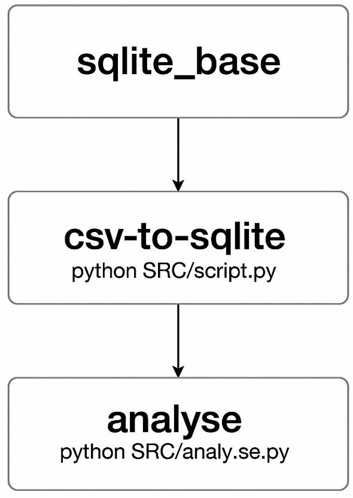
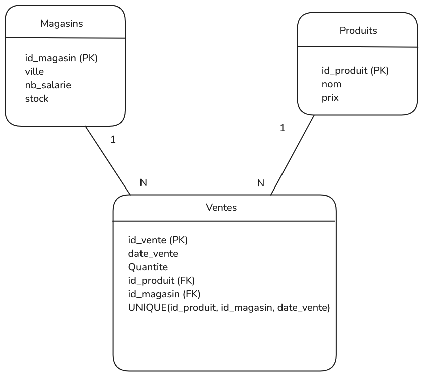

# Projet SIMPLON (CSV ➜ SQLite avec Docker)

## Objectif du projet

- Lire un ou plusieurs fichiers **CSV**.
- Générer une base **SQLite** contenant les données.
- Permettre des **requêtes SQL interactives** sur la base via Docker.

---

## Architecture (Docker)

Ce projet utilise **deux services Docker** définis dans `docker-compose.yml` :

| Service       | Rôle                                                                     |
|---------------|--------------------------------------------------------------------------|
| `csv-runner`  | Exécute le script Python de transformation CSV ➜ SQLite                 |
| `sqlite_base` | Conteneur persistant pour accéder à la base SQLite et faire des requêtes |

**Schéma de l'architecture** :  


---

##  Arborescence du projet
```
├── DATA/
│   ├── magasins.csv              # CSV source des magasins
│   ├── produits.csv              # CSV source des produits
│   ├── ventes.csv                # CSV source des ventes
│   └── pme.db                    # Base SQLite générée automatiquement
│
├── SRC/
│   └── script.py                 # Script Python de transformation CSV ➜ SQLite
│
├── docker_architecture.png       # Schéma visuel de l'architecture
├── requirements.txt              # Dépendances Python
├── Dockerfile                    # Image Docker (Python + SQLite)
├── docker-compose.yml            # Définition des services
└── README.md                     # Documentation du projet
```
---

##  Fonctionnalités du script Python

    Description des étapes dans le script :
        - Nettoie et renomme les colonnes des CSV
        - Crée les tables dans pme.db si elles n’existent pas
        - Insère les données en base
        - Respect des clés primaires/étrangères et l’auto-incrément de id_vente

---

##  Comment exécuter l'application avec Docker
1.  **Installer Docker** si ce n’est pas déjà fait :  
    [Docker Desktop](https://www.docker.com/products/docker-desktop)

2.  Ouvrir un terminal dans le dossier du projet

3.  **Construire et démarrer les conteneurs :**
```bash
docker compose up --build -d
```

4.  **Vérifier que tout tourne :**
```bash
docker ps
```

5.  **Accéder à SQLite dans le conteneur :**
```bash
docker exec -it sqlite_base bash
sqlite3 /app/DATA/pme.db
```

---

**Schéma de la base de données** :  


---


## Requêtes SQL dans SQLite

Voici quelques commandes utiles une fois dans le client SQLite :

```sql
.tables                    -- Voir les tables disponibles
.schema Ventes             -- Voir la structure de la table "Ventes"
SELECT * FROM Ventes;      -- Voir les ventes
```
---

## Quitter l’application
- Quitter sqlite :
```bash
.quit
```
- Sortir du container :
```bash
Exit
```
- Pour arrêter le conteneur (à la fin de l'utilisation) :
```bash
docker compose down
```  

---

## Analyse des Données (via analyse.py)

- Exécuter l’analyse (en supprimant le conteneur automatiquement après) :
```bash
docker compose run --rm analyse
```

Le script analyse.py permet d'extraire des indicateurs clés à partir des données de la base pme.db.
Requêtes effectuées :

    1. Chiffre d'affaires total
    
    2. Quantité de produits par magasin

    3. Produit le plus vendu

    4. Chiffre d'affaires par magasin (quantité × prix unitaire)


---

## Gestion des Erreurs:
1. **Afficher des Logs en cas d'erreurs :**
```bash
docker-compose up csv-to-sqlite
```
---
## 📬 Contact

👤 Damien S
🔗 [LinkedIn](https://www.linkedin.com/in/damien-schaeffer-45a59821b/)
---